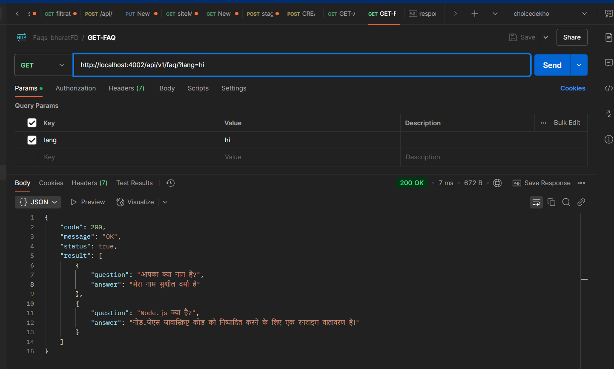

# Faq-multi-language-translation

This is a Node.js-based backend application for managing FAQs with multilingual support, and caching using Redis. The application provides a REST API to fetch and create FAQs in multiple languages.

## **Features**

- **Multilingual FAQs**: Supports FAQs in multiple languages (e.g., English, Hindi, Bengali).
- **Caching**: Uses Redis to cache FAQ translations for improved performance.
- **REST API**: Provides endpoints to fetch and create FAQs.
- **Automated Translations**: Uses Google Translate API to automatically translate FAQs during creation.
- **Docker Support**: Easily deployable using Docker and Docker Compose.

---

## **Technologies Used**

- **Node.js**: Runtime environment.
- **Express.js**: Web framework for building the REST API.
- **MongoDB**: Database for storing FAQs.
- **Redis**: Caching layer for storing translations.
- **Google Translate API**: For automated translations.
- **Docker**: added compose.yml for docker support..

---

---

## **Middleware**

- **Redis**: redis config.

---

## **Installation**

### Prerequisites

- Node.js (v16 or higher)
- MongoDB
- Redis
- Docker (optional)

### Steps

1. Clone the repository:

   ```bash
   git clone https://github.com/Sushilverma002/Faq-multi-language-translation.git
   cd Faq-multi-language-translation

   ```

2. **Install dependencies**:

   ```bash
   npm install
   ```

3. **Set up environment variables**:
   Create a `.env` file in the root of the project with the following content:

   ```
   DB_URL="mongodb://localhost:27017/faqs-translator"

   PORT=4002

   ```

4. **Run the project**:
   ```bash
   npm start
   ```
   The API will be available at `http://localhost:4002`.

## **API Endpoints**

### ** Routes**

- **POST /api/v1/faq**: To create FQS.
- **GET /api/v1/faq-all**: Fetches all the faqs in db.
- **GET /api/v1/faq/?lang=hi**: Retrieves a list of faq's on the basis of language.

### Post Collection

I have added an exported Postman collection file (FAQ_Backend.postman_collection.json) in the docs folder for easy testing of the API endpoints. You can import this file into Postman to quickly get started.


